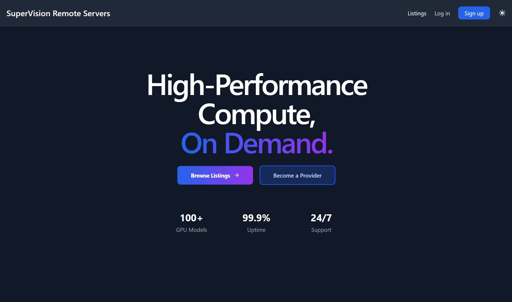

# Remote Servers Marketplace

A full-stack platform for renting high-performance computing (HPC) and AI/ML servers.
Providers can list dedicated machines, and buyers can securely book compute resources.



## Built with:

### FastAPI
FastAPI facilitated the entire full-stack development process of this application. It provides fantastic dependency injection, which I used in the application to validate authentication in the API routes. Its schema validation via Pydantic and out-of-the-box API documentation are also very handy for this e-commerce application, which required a high level of detail in payload handling and visualization of my endpoints.

---

### PostgreSQL
PostgreSQL is a highly performant relational database that I used for data persistence. A useful feature that applies to this project specifically is complex queries, which will be expanded to handle more intensive database operations.

---

### Pytest
Coming from a software testing background, I needed a robust tool to handle all of my testing needs in ensuring the robustness of my backend functionality. Pytest provides exactly this: comprehensive testing features and test fixtures for my database transaction and rollback (database start and stop so that each test which involved data persistence could reset to a clean state in preparation for the next test). It also works flawlessly with unittest to provide mocking and patching for unit tests.

Here's a unit test I wrote for the bookings domain service file:
```python
def test_normalize_times_converts_to_utc(self, bookings_service):
    """Test time normalization converts aware datetimes to UTC"""
    est_offset = timezone(timedelta(hours=-5))
    start_time = datetime(2026, 1, 15, 10, 0, 0, tzinfo=est_offset)
    ist_offset = timezone(timedelta(hours=5, minutes=30))
    end_time = datetime(2026, 1, 15, 22, 0, 0, tzinfo=ist_offset)
    
    start_utc, end_utc = bookings_service.normalize_times(start_time, end_time)
    
    assert start_utc.tzinfo == timezone.utc
    assert end_utc.tzinfo == timezone.utc
    
    assert start_utc == start_time.astimezone(timezone.utc)
    assert end_utc == end_time.astimezone(timezone.utc)
    
    assert start_utc.hour == 15
    assert end_utc.hour == 16
    assert end_utc.minute == 30
```

---

### Supabase Auth
Supabase was particularly useful in handling all authentication for the web login and sign up features. A specific benefit is its ability to persist user login data (given it is a database service). This kept user credentials consistent across development and production environments.

---

### Tailwind/Flowbite
Flowbite's free library of Tailwind CSS UI components was singularly instrumental in providing me with the ability to create a responsive and visually appealing frontend. I chose Flowbite for the fantastic docs and massive library of comprehensive frontend components.

---

### GitHub Actions CI/CD
GitHub Actions provides a lot of functionality for test artifacts and it integrates beautifully with my repo code; thus, it was the natural choice for my CI/CD needs. In the `ci.yml` file, you can see that I've enforced a minimum 80% code coverage.

---

### Render
With Render, I was able to fully deploy this project with little to no extra configuration. To ensure data persistence, I used a combination of Render Web Services for this application and a Postgres service to store platform data like bookings and payments.